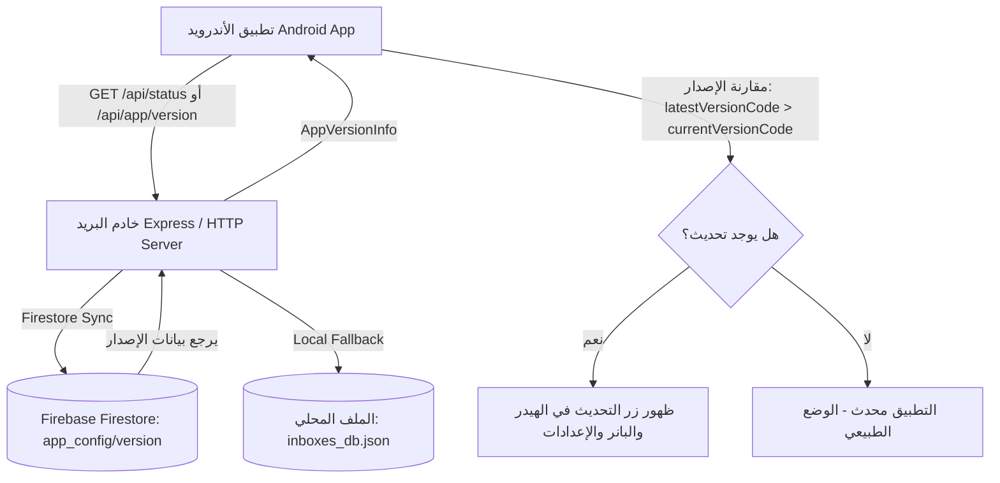

# 🚀 دليل نظام التحديث المباشر للتطبيق (In-App Update & Agent Guide)

مرحباً بك! هذا الدليل مخصص لأي **وكيل ذكاء اصطناعي (AI Agent)** أو **مطور** يعمل على مشروع **Batabitoo Mail Center**. يوضح هذا المستند كيفية عمل منظومة التحديث التلقائي، وكيفية نشر تحديث جديد وتعديل بيانات الإصدار ورابط التحميل في قاعدة البيانات دون المساس باستقرار النظام.

---

## 📌 1. الهيكلية العامة للنظام (Architecture Overview)

يعتمد تطبيق الأندرويد على قاعدة البيانات السحابية (Firebase Cloud Firestore) والخادم المحلي لمعرفة أحدث إصدار متوفر للتطبيق:



---

## 🗄️ 2. هيكل بيانات الإصدار (Database Schema)

تُخزن بيانات الإصدار في:
1. **Firebase Cloud Firestore**:
   - المجموعة: `app_config`
   - الوثيقة: `version`
2. **التخزين المحلي**:
   - الملف: `inboxes_db.json`
   - الحقل: `appVersion`

### نموذج البيانات (JSON):
```json
{
  "latestVersionCode": 2,
  "latestVersionName": "1.1.0",
  "downloadUrl": "https://batabitoo-mail-2026.web.app/downloads/Batabitoo-Mail-Center.apk",
  "releaseNotes": "تحسين شامل للواجهة، كشف حسابات أمازون المحظورة، وإنشاء حسابات تتابعية",
  "mandatory": false,
  "updatedAt": "2026-09-16T04:00:00.000Z"
}
```

| الحقل | النوع | الوصف |
| :--- | :--- | :--- |
| `latestVersionCode` | `Int` | الرقم التسلسلي للإصدار (يجب أن يكون أكبر من رقم إصدار التطبيق المثبت ليظهر التحديث). |
| `latestVersionName` | `String` | الاسم الظاهر للإصدار للمستخدمين (مثل `1.1.0` أو `2.0.0`). |
| `downloadUrl` | `String` | رابط تنزيل حزمة الـ APK المباشر. |
| `releaseNotes` | `String` | الملاحظات وقائمة التحسينات الجديدة المعروضة للمستخدم داخل نافذة التحديث. |
| `mandatory` | `Boolean` | إذا كانت `true`، فلن يتمكن المستخدم من تخطي نافذة التحديث وسيلزمه التحديث. |
| `updatedAt` | `String` | تاريخ ووقت نشر التحديث بصيغة ISO 8601. |

---

## 🛠️ 3. كيفية إصدار ونشر تحديث جديد (How to Release an Update)

عندما يطلب منك المستخدم إصدار تحديث جديد، اتبع هذه الخطوات بالترتيب:

### الخطوة 1: زيادة رقم الإصدار في كود الأندرويد
عدل الملف `android/app/build.gradle.kts`:
```kotlin
defaultConfig {
    applicationId = "com.batabitoo.mailcenter"
    minSdk = 24
    targetSdk = 36
    versionCode = 2        // قم بزيادة الرقم (1 -> 2 -> 3 ...)
    versionName = "1.1.0"  // حدث اسم الإصدار
}
```

### الخطوة 2: بناء حزمة الإصدار (Release APK)
قم بتشغيل أمر البناء داخل مجلد `android/`:
```pwsh
cd android
.\gradlew.bat assembleRelease
```
يتم توليد الملف في المسار:
`android/app/build/outputs/apk/release/app-release.apk`

انسخه إلى المجلد الرئيسي أو مجلد التوزيع:
```pwsh
Copy-Item "android/app/build/outputs/apk/release/app-release.apk" -Destination "Batabitoo-Mail-Center-1.1.0.apk"
```

### الخطوة 3: تحديث قاعدة البيانات ورابط الإصدار

يمكنك تحديث بيانات الإصدار بأي من الطرق التالية:

#### الطريقة الأولى (موصى بها عبر الـ API):
أرسل طلب `POST` إلى نقطة النهاية `/api/app/version`:
```http
POST http://localhost:3030/api/app/version
Content-Type: application/json

{
  "latestVersionCode": 2,
  "latestVersionName": "1.1.0",
  "downloadUrl": "https://github.com/ahmedroou/batabitoo-releases/releases/download/v1.1.0/Batabitoo-Mail-Center-1.1.0.apk",
  "releaseNotes": "تحسينات التصميم، كشف حسابات أمازون المحظورة، إنشاء بريد تتابعي، وإدارة التخزين والمساحة.",
  "mandatory": false
}
```
*ملاحظة:* الخادم سيقوم فوراً بتحديث الملف المحلي ومزامنته مع Cloud Firestore.

#### الطريقة المعتمدة لرفع الـ APK واستضافته مجاناً عبر GitHub Releases:
بدلاً من استهلاك كوتة Firebase أو مساحة الخادم، يتم رفع حزم الـ APK مجاناً إلى مستودع الإصدارات العام `ahmedroou/batabitoo-releases` عبر GitHub CLI:
```pwsh
gh release create v1.1.0 Batabitoo-Mail-Center-1.1.0.apk --repo ahmedroou/batabitoo-releases --title "Batabitoo Mail Center v1.1.0" --notes "تفاصيل التحديث..."
```
ويكون رابط التنزيل المباشر الصالح للتحميل الفوري دون أي قيود:
`https://github.com/ahmedroou/batabitoo-releases/releases/download/v1.1.0/Batabitoo-Mail-Center-1.1.0.apk`

#### الطريقة الثانية (تعديل كود قاعدة البيانات مباشرة عبر Node.js):
عبر استدعاء وظيفة `InboxDatabase.js`:
```javascript
const db = require('./InboxDatabase');
await db.updateAppVersion({
  latestVersionCode: 2,
  latestVersionName: "1.1.0",
  downloadUrl: "https://github.com/ahmedroou/batabitoo-releases/releases/download/v1.1.0/Batabitoo-Mail-Center-1.1.0.apk",
  releaseNotes: "تفاصيل التحديث هنا..."
});
```

---

## 📱 4. كيف يظهر التحديث في واجهة التطبيق؟

بمجرد وجود إصدار أحدث (`latestVersionCode > currentVersionCode`):
1. **في الهيدر العلوي (Header)**: يظهر زر برتقالي نابض يحمل نص `تحديث جديد 🚀`.
2. **في الشاشة الرئيسية (Inboxes Screen)**: يظهر كارد تنبيه مدمج ومرئي يحمل رقم الإصدار وزر `تحديث`.
3. **في شاشة الإعدادات (Settings Screen)**: بطاقة كاملة تظهر رقم الإصدار الحالي والمتاح وزر `فحص التحديثات` وزر `تحديث الآن`.
4. **نافذة التحديث (InAppUpdateDialog)**: نافذة تفتح عند الضغط على أي زر تحديث وتتيح التنزيل والتثبيت مباشرة.

---

## 💡 5. إرشادات سريعة للوكلاء (Tips for AI Agents)
- **فحص الإصدار الحالي**: استعرض `android/app/build.gradle.kts` لمعرفة `versionCode` الحالي.
- **تجنب تضارب التخزين**: وظيفة `db.updateAppVersion()` تتولى كتابة البيانات محلياً وإرسالها إلى Firestore تلقائياً مع معالجة الأخطاء.
- **الاختبار**: يوجد اختبار وحدة مخصص `MailJsonTest.kt` للتحقق من فحص التحديثات بدقة 100%.
